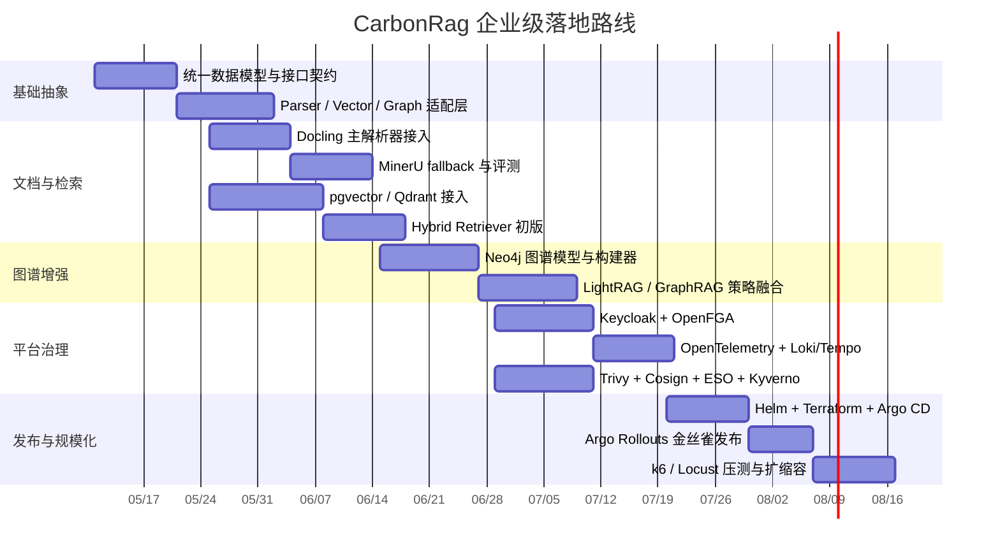

# CarbonRag 企业级开源参考与落地方案报告

## 执行摘要

面向 CarbonRag 这类知识库 / RAG / GraphRAG 项目，如果你的目标不是做一个“能跑”的 Demo，而是要让 Codex 能按模块、按里程碑、按可回滚方式持续落地，我建议把方案拆成四层：文档解析层、检索与索引层、编排与应用层、平台治理层。公开仓库里，`RAGFlow`、`Dify`、`FastGPT`、`MaxKB` 已经把“知识库 + 工作流 / Agent + 私有化部署”做成了较完整产品；而 `Haystack`、`LangGraph`、`LlamaIndex` 更适合作为可控、自研、可插拔的工程底座。对于图谱增强检索，entity["company","Microsoft","software company"] 的 GraphRAG 方法、`HKUDS/LightRAG` 的轻量实现，以及 entity["company","Neo4j","graph database company"] 社区的 `ms-graphrag-neo4j`，是最值得直接借鉴的三条线。citeturn11search4turn26search6turn11search10turn26search0turn12search0turn12search2turn26search7turn20search0turn11search6

如果你希望“快落地、但仍保留企业级演进空间”，我给出的首选组合不是整仓 fork 某一个平台，而是采用“能力层拼装”思路：用 `Docling + MinerU` 做双解析器与回退链路；用 `Qdrant / Milvus / pgvector` 做向量检索；用 `Neo4j + LightRAG` 做图谱补强；用 `LangGraph + Haystack` 做可控编排；用 `Keycloak + OpenFGA / Casbin` 做认证授权；用 OpenTelemetry、Prometheus、Loki、Tempo 做统一可观测；用 `Argo CD + Helm + Terraform + Argo Rollouts` 做 GitOps 和渐进式发布；再用 `Trivy + Cosign + External Secrets + Kyverno/OPA` 做供应链与策略治理。这样做的核心收益是：技术上更可控，许可证更安全，团队更容易把每一步交给 Codex 独立实施。citeturn25search0turn25search2turn18search3turn18search2turn19search3turn20search0turn11search6turn12search2turn12search0turn14search18turn28search3turn28search4turn13search4turn16search1turn16search0turn17search0turn21search0turn21search1turn21search5turn24search1turn21search2turn22search0turn22search2turn14search1turn28search0

从许可证与商业可控性看，`RAGFlow`、`Haystack`、`LangGraph`、`Milvus`、`Qdrant`、`OPA`、`Argo CD`、`KEDA` 等项目更适合作为“直接集成型”底座；`MaxKB` 为 GPLv3，`Dify` 采用带附加条件的开源许可证，因此更适合“产品参考 / 界面参考 / 功能拆解参考”，而不建议在闭源商业主干里直接复制其核心代码。`Weaviate` 也很适合做强能力向量库，但如果你更强调私有化简单部署与 SQL 生态，`pgvector` 的改造成本会更低。citeturn11search4turn12search0turn12search2turn18search2turn18search3turn28search0turn21search0turn22search3turn26search0turn26search6turn18search0turn19search3

## 相似与可复用 GitHub 项目地图

下面这张表不是“哪个好看”列表，而是按 CarbonRag 未来企业化最常见的实施方向来选“最值得 Codex 借鉴的仓库”。我把它分成“优先借鉴”“备选借鉴”和“Codex 应复制的工程思路”三类；你们真正需要复用的是抽象接口、任务边界、数据模型、部署模式和运维脚手架，而不是整仓照搬。citeturn11search4turn26search6turn26search0turn12search0turn12search2turn25search0turn25search2turn18search3turn18search2turn19search3turn20search0turn21search0turn24search1turn22search0

| 方向 | 优先参考仓库 | 备选仓库 | 最值得借鉴的能力 | 给 Codex 的落地动作 | 证据 |
|---|---|---|---|---|---|
| 端到端产品能力 | `infiniflow/ragflow` | `langgenius/dify`、`labring/FastGPT`、`1Panel-dev/MaxKB` | 文档理解、知识库、可视化工作流、API、私有化部署 | 先拆出模块边界：知识库服务、工作流服务、模型网关、前端门户，而不是整仓 fork | citeturn11search4turn26search6turn11search10turn26search0 |
| Agent / 工作流编排 | `langchain-ai/langgraph` | `deepset-ai/haystack`、`langchain-ai/langchain`、`run-llama/llama_index` | 状态机、长流程、可恢复执行、透明检索链路 | 抽象 `WorkflowNode`、`StateStore`、`ExecutionCheckpoint` | citeturn12search2turn12search0turn26search4turn26search7 |
| 文档解析与摄取 | `docling-project/docling` | `opendatalab/MinerU`、`Unstructured-IO/unstructured`、`HKUDS/RAG-Anything` | PDF/Office/图表/表格/公式解析，多模态内容标准化 | 做 `ParserProvider` 接口，支持主解析器 + fallback 解析器 + 解析质量评分 | citeturn25search0turn25search2turn25search4turn25search1 |
| 向量检索 | `qdrant/qdrant` | `milvus-io/milvus`、`pgvector/pgvector`、`weaviate/weaviate` | 混合检索、过滤、量化、分布式扩展、多租户 | 做 `VectorStoreAdapter`，统一 upsert / search / delete / filter 语义 | citeturn18search3turn18search2turn19search3turn18search0 |
| GraphRAG / 图谱检索 | `HKUDS/LightRAG` | `neo4j-contrib/ms-graphrag-neo4j`、Neo4j 向量索引/语义索引 | 实体关系抽取、社区发现、局部/全局检索融合 | 做 `GraphIndexBuilder` 与 `HybridRetriever`，把向量召回与图召回统一在一个策略层 | citeturn11search6turn20search0turn20search2turn20search16 |
| 认证与细粒度授权 | `openfga/openfga` | `casbin/casbin`、`open-policy-agent/opa` | ReBAC / ABAC / RBAC、策略下沉、资源级授权 | 认证交给 Keycloak，资源授权交给 OpenFGA；进程内快速判定可用 Casbin | citeturn28search3turn28search4turn28search0turn14search14turn14search15 |
| GitOps / 发布 | `argoproj/argo-cd` | `argoproj/argo-rollouts`、`helm/helm`、`hashicorp/terraform` | 声明式交付、金丝雀 / 蓝绿、基础设施即代码 | 建 `infra/`、`charts/`、`environments/` 三层仓库结构 | citeturn21search0turn24search1turn21search1turn21search5 |
| 可观测 | `open-telemetry/opentelemetry-collector-contrib` | Loki / Tempo / Grafana / Prometheus 体系 | 统一 traces / metrics / logs、Collector 网关、跨信号关联 | 所有服务先打 OTel，再统一进 Collector 网关，而不是各写各的埋点 | citeturn22search1turn13search4turn16search0turn17search0turn16search1 |
| 安全与供应链 | `aquasecurity/trivy` | `sigstore/cosign`、`external-secrets/external-secrets`、`kyverno/kyverno` | 漏洞 / 密钥 / IaC 扫描、镜像签名、Secrets 外置、策略准入 | 在 CI 里加 Trivy、制品签名、策略校验；在 K8s 里启用 Kyverno / OPA | citeturn21search2turn22search0turn22search2turn14search1turn28search0 |
| 测试与压测 | `pytest-dev/pytest` | `testcontainers/testcontainers-python`、`grafana/k6`、`locustio/locust` | 单测、集成测、服务依赖容器化测试、压测基线 | 把 e2e 环境拉起逻辑固定到 Testcontainers，压测脚本纳入 CI 门禁 | citeturn23search1turn23search6turn23search0turn23search2 |

在“相似项目”这件事上，我建议你们优先观察三条路线。第一条是“平台型路线”：`Dify`、`FastGPT`、`MaxKB`、`RAGFlow`，优势是产品功能全、交互成熟、便于快速对标。第二条是“框架型路线”：`LangGraph`、`Haystack`、`LlamaIndex`，优势是工程可控、适合 Codex 分阶段生成。第三条是“算法增强路线”：`LightRAG`、`RAG-Anything`、`ms-graphrag-neo4j`，优势是明显提升复杂文档、多跳问答和可解释性。对 CarbonRag 来说，企业化最稳的路径通常是“平台参考 + 框架自研 + 算法增强”，也就是界面和产品能力借鉴前者，核心服务用中者重写，难点检索能力从后者引入。citeturn26search6turn11search10turn26search0turn11search4turn12search2turn12search0turn26search7turn11search6turn25search1turn20search0

## 企业级参考架构与技术选型

我建议 CarbonRag 的企业级目标架构采用“控制面与数据面分离”的思路：入口层是统一门户和 API 网关；编排层负责 Agent、工作流、检索策略和模型路由；数据层由对象存储、关系库、向量库、图数据库组成；平台层用 Kubernetes、GitOps、可观测和策略治理收口。这样做的原因很简单：`LangGraph` 适合复杂状态流，`Haystack` 适合显式检索链路，`Docling/MinerU` 适合复杂文档，`Qdrant / Milvus / pgvector` 适合不同规模的向量检索，`Neo4j` 适合把实体关系和向量索引统一到可解释检索里，而 `Argo CD`、`KEDA`、OpenTelemetry、Kyverno / OPA 则负责把系统从 PoC 拉到企业级。citeturn12search2turn12search0turn25search0turn25search2turn18search3turn18search2turn19search3turn20search2turn21search0turn22search3turn13search4turn14search1turn28search0

更具体地说，文档解析层建议采用“双解析器”模式：`Docling` 作为主解析器，负责 Office、HTML、复杂 PDF、表格、公式等通用场景；`MinerU` 作为复杂版式与学术 PDF 的 fallback，专门处理多栏布局、页眉页脚清洗、公式转 LaTeX、图片与表格抽取。若你们未来要做真正的多模态文档问答，再把 `RAG-Anything` 挂到解析后的内容标准之上，让“文本、图像、表格、公式”都能进入统一索引。这个组合比单押一个解析器更稳，因为它天然支持 A/B 评测、质量回退和持续替换。citeturn25search0turn25search2turn25search1

检索层不建议“一把梭”只上某一个向量库。小中型、单团队、强调开发效率的场景，用 `pgvector` 往往最省心，因为它直接继承 Postgres 的 ACID、PITR、JOIN 和 SQL 生态；如果文档量级上到百万到千万 chunk、过滤复杂、需要量化与分片扩展，`Qdrant` 和 `Milvus` 更合适；如果你希望把“向量检索 + 过滤 + RAG + rerank + 多租户 + RBAC”尽量收在一个数据库里，`Weaviate` 也有很强吸引力。图谱检索层则建议固定用 `Neo4j` 或兼容的图数据库做实体关系承载，并结合 `LightRAG` 或 `ms-graphrag-neo4j` 实现社区摘要、局部 / 全局检索融合。citeturn19search3turn18search3turn18search2turn18search0turn20search2turn20search16turn11search6turn20search0

认证授权层应当分成两件事：用户身份由 `Keycloak` 管，资源权限由 `OpenFGA` 或 `Casbin` 管。`Keycloak` 已经提供 OIDC / OAuth2 / SAML 能力，适合做企业 SSO、令牌签发和 IdP 联邦；`OpenFGA` 更适合文档、知识库、租户、团队、工作流这类“资源级、关系型”的细粒度授权模型；如果你们希望在应用内部做快速判定，也可以把 `Casbin` 作为服务内授权中间件。基础设施策略治理则交给 `OPA` 或 `Kyverno`，前者适合跨栈策略决策，后者更适合 Kubernetes 原生准入与策略报告。citeturn14search14turn14search15turn28search3turn28search4turn28search0turn14search1

在平台治理上，建议优先选用 entity["organization","CNCF","cloud foundation"] 生态的成熟项目。`Kubernetes` 负责调度与弹性伸缩，`KEDA` 负责事件驱动扩缩容和 scale-to-zero，`Argo CD` 负责 GitOps 持续交付，`Argo Rollouts` 负责金丝雀 / 蓝绿发布，`Istio` 或 `Cilium` 负责服务间安全、流量治理与 mesh 级可观测，OpenTelemetry 负责编码埋点与 Collector 汇聚，Prometheus / Loki / Tempo 负责三大信号的度量、日志和分布式追踪。这个组合的好处是：你们以后无论做私有化、混合云还是多集群，演进路径都比较直。citeturn24search6turn22search3turn21search0turn24search1turn24search0turn24search2turn13search4turn22search4turn16search1turn16search0turn17search0

下面这张表是“典型自研 RAG PoC vs 企业级目标”的代理比较表。由于本次无法稳定抓取 CarbonRag 仓库页，我只能用“常见自研 PoC 状态”来代替 CarbonRag 当前实现做对照，但这张表很适合你们内部拿去和现状一项一项核对。citeturn27view0

| 维度 | 典型 PoC 状态 | 企业级目标状态 | 推荐项目 |
|---|---|---|---|
| 文档解析 | 单解析器、难处理复杂 PDF | 双解析器 + 质量回退 + 内容标准化 | Docling、MinerU、RAG-Anything |
| 检索 | 单一向量召回 | 向量 + BM25/稀疏 + rerank + GraphRAG | Qdrant / Milvus / pgvector + Neo4j + LightRAG |
| 编排 | 线性调用链 | 状态化工作流、可恢复执行、人审节点 | LangGraph、Haystack |
| 权限 | 仅 JWT / RBAC | OIDC / SSO + 资源级授权 + 审计 | Keycloak、OpenFGA、OPA、Kyverno |
| 可观测 | 零散日志 | 统一 traces / metrics / logs 及链路关联 | OpenTelemetry、Prometheus、Loki、Tempo |
| 部署 | 手工脚本 / docker compose | Helm + Terraform + GitOps + Rollout | Helm、Terraform、Argo CD、Argo Rollouts |
| 安全 | 基础镜像 + 手工发布 | Trivy、SBOM、镜像签名、Secrets 外置 | Trivy、Cosign、External Secrets |
| 测试 | 冒烟测试 | 单测 / 集成测 / e2e / 压测 / 回归基线 | pytest、Testcontainers、k6、Locust |

## 面向 Codex 的分步骤实施清单

如果你真的要“让 Codex 去做每一步”，最关键的不是告诉它“搭一个企业级系统”，而是给它明确的模块契约、验收标准和参考仓库。我的建议是先做“抽象与替身层”，再做“真实依赖接入”，最后做“治理与发布”。这个顺序能最大限度减少一次性重构。citeturn12search2turn12search0turn21search0turn21search5

第一步，先建立统一的数据契约。你们需要定义 `ParsedDocument`、`Chunk`、`EmbeddingRecord`、`GraphEntity`、`GraphRelation`、`CitationRef`、`PermissionScope`、`TraceContext` 这些核心对象，并把文档解析、向量索引、图谱构建、回答生成都围绕这组对象做适配。这样后面无论是接入 `Docling`、`MinerU` 还是 `Qdrant`、`pgvector`，都不会污染业务层。这个做法本质上是在借鉴 `Haystack` 的模块化组件边界和 `LangGraph` 的显式状态流。citeturn12search0turn12search2

第二步，做文档解析抽象与回退链路。建议 Codex 先落地如下接口，再分别实现 `DoclingParser` 与 `MinerUParser`：

```python
class ParserProvider(Protocol):
    def supports(self, mime: str, name: str) -> bool: ...
    def parse(self, file_path: str) -> ParsedDocument: ...
    def score(self, doc: ParsedDocument) -> float: ...

def parse_with_fallback(file_path: str) -> ParsedDocument:
    primary = docling.parse(file_path)
    if quality_score(primary) >= 0.82:
        return primary
    backup = mineru.parse(file_path)
    return pick_better(primary, backup)
```

验收标准不是“能出 Markdown”，而是至少要有：页级坐标、标题层级、表格结构、图片路径、公式文本、引用源定位，以及解析质量评分。需要对同一批样本文档做 A/B 回归，后续再决定主解析器。这个思路直接对应 `Docling` 的统一文档表示能力与 `MinerU` 的复杂版式解析优势。citeturn25search0turn25search2

第三步，做索引层抽象。建议先实现一个统一的 `IndexingPipeline`，把“切块、去重、向量化、索引写入、图谱写入”拆开。小规模阶段可以先用 `pgvector`，因为它最利于事务一致性、开发调试和 SQL 管理；中大规模时再把 `Qdrant` 或 `Milvus` 接入 `VectorStoreAdapter`。图谱部分则单独实现 `GraphIndexBuilder`，优先把实体、关系、社区摘要持久化到 `Neo4j`，并在检索阶段做“向量召回 -> graph expand -> rerank -> answer compose”。citeturn19search3turn18search3turn18search2turn20search0turn11search6

第四步，做检索策略层，而不要把检索逻辑写死。你们至少需要四种策略：`dense_only`、`hybrid_sparse_dense`、`graph_augmented`、`citation_first`。`LightRAG` 和 `ms-graphrag-neo4j` 最大的参考价值不在于“照搬算法”，而在于它们证明了图社区摘要、实体关系扩展、多阶段检索对复杂问答确实有价值。Codex 可以先把策略层做出来，再逐步把不同召回器挂上去。citeturn11search6turn20search0turn20search14

第五步，编排层优先采用“LangGraph 做工作流骨架，Haystack 做可解释检索节点”的混合方案。原因是 `LangGraph` 在长流程、持久状态、人审中断、失败恢复方面更像工程基础设施，而 `Haystack` 在检索、路由、记忆、透明组件化上更适合做 RAG 组件库。你们可以把“知识库问答”“文档重建索引”“租户同步任务”“批量离线评测”都抽象成图中的不同 node，而不是塞进一个巨大的 service。citeturn12search2turn12search0

第六步，身份与权限要尽早建，而不是上线前补。推荐模型是：`Keycloak` 发身份，CarbonRag 内部只消费 OIDC token；文档、知识库、团队、租户、工作流、调试日志这些资源权限进入 `OpenFGA`；服务内需要高频本地判断时用 `Casbin` 缓存若干策略子集。基础设施层再用 `OPA` / `Kyverno` 检查镜像签名、命名空间隔离、资源配额、Pod 安全要求。citeturn14search14turn14search15turn28search3turn28search4turn28search0turn14search1

第七步，可观测要从第一天开始。所有 HTTP / gRPC / 队列 / 索引任务都带 trace ID，并进入 OpenTelemetry Collector；业务日志必须写可检索字段，如 `tenant_id`、`kb_id`、`doc_id`、`chunk_id`、`workflow_run_id`、`trace_id`；核心 SLI 建议至少包括检索时延、答案生成时延、召回覆盖率、rerank 命中率、索引延迟、队列积压、解析失败率和授权拒绝率。因为 OpenTelemetry 的核心价值正是 logs / metrics / traces 的统一资源上下文与关联分析。citeturn13search4turn13search3turn13search0turn22search4turn16search1turn16search0turn17search5

第八步，CI/CD 与发布体系不要等到“功能稳定再做”。最合理的方式是把 `Helm` chart、`Terraform`、`Argo CD Application`、`Argo Rollouts` 一起当成主仓的一部分。CI 至少分五道门：代码风格 / 单测、容器构建、Trivy 扫描、SBOM 与签名、部署清单策略校验。CD 再用 GitOps 按环境推进，生产环境默认金丝雀，并把业务 KPI 与错误率接进 Rollouts 分析，触发自动中止或回滚。citeturn21search1turn21search5turn21search0turn24search1turn21search2turn22search0turn14search8

最后一步才是“产品体验收口”。这时你可以再回头借鉴 `Dify`、`MaxKB`、`FastGPT`、`RAGFlow` 的产品能力：知识库管理台、工作流画布、调试日志、引用展示、模型配置、多模态输入、第三方系统集成。我的建议是“前台参考这些平台，后台保持自研”。这样做既能快速接近成熟产品体验，又不会把底层架构锁死在某个外部项目上。citeturn26search6turn26search0turn11search10turn11search4

## 规模、预算与合规分档建议

因为你没有给吞吐、并发和数据规模，我把建议分成小 / 中 / 大三档。这里的成本是“自建私有化、未含大模型 token / GPU 训练费用”的粗略区间，主要用于立项判断，不应当当作采购报价。容量估算则优先按“chunk 数量、在线并发、索引增长速度、SLO 要求”来推。Kubernetes、KEDA、Neo4j 集群、Tempo 等项目都给出了清晰的集群扩展或 sizing 思路，因此下面的建议是有工程依据的，但成本数字本身属于推算值。citeturn24search6turn22search3turn20search5turn17search14

| 规模 | 典型数据量 | 在线并发 / 检索 QPS | 推荐架构 | 粗略月成本区间 | 适合的技术组合 |
|---|---|---|---|---|---|
| 小 | 10万–50万 chunks；几十到数百 GB 原文 | 50–200 并发；5–20 QPS | 单区 K8s；Postgres + `pgvector`；对象存储；可选单实例 Neo4j | 约 ¥4,000–¥12,000 | Docling + pgvector + LangGraph + Haystack + Keycloak |
| 中 | 500万–2,000万 chunks；TB 级原文 | 300–1,000 并发；30–100 QPS | 3–6 节点 K8s；Qdrant 或 Milvus；3 节点 Neo4j；OTel + GitOps | 约 ¥20,000–¥80,000 | Docling + MinerU + Qdrant/Milvus + Neo4j + Argo CD |
| 大 | 5,000万+ chunks；多 TB 到 PB 级归档 | 2,000+ 并发；150+ QPS | 多集群 / 多可用区；Milvus 或 Weaviate；Neo4j Enterprise 集群；服务网格；专门索引队列 | 约 ¥100,000–¥400,000+ | MinerU + Milvus/Weaviate + Neo4j + Istio/Cilium + OpenFGA |

预算维度上，我建议三种打法。低预算优先选 `pgvector`，把数据库、元数据、审计、权限关系尽量收敛在 Postgres 生态，文档解析先上 `Docling`，复杂 PDF 再用 `MinerU` 点状补充；中预算则上 `Qdrant` 或 `Milvus`，并把 GraphRAG 和观测治理提前建设；高预算 / 高合规场景则建议上多可用区、多集群、对象存储、Secrets 外置、镜像签名、策略准入、细粒度授权和统一审计，必要时把模型网关与外部 API 出口隔离到独立网络域。citeturn19search3turn25search0turn25search2turn18search3turn18search2turn22search2turn22search0turn14search1turn28search0turn28search3

合规方面，可以按“基础、增强、严格”三档理解。基础档至少要做到 SSO、TLS、备份恢复、漏洞扫描和审计日志；增强档要增加细粒度授权、镜像签名、Secrets 外置、策略即代码、可观测三信号统一；严格档则要增加 mTLS、跨区韧性、租户隔离、留存策略、变更审计、受控发布与供应链证明。`Istio`、`Cilium`、`Cosign`、`Kyverno`、`OPA`、OpenTelemetry、`External Secrets` 就是这几档逐层加码时最实用的开源积木。citeturn15search2turn24search2turn22search0turn14search1turn28search0turn13search4turn22search2

## 迁移时间线与开放问题

如果以“让 Codex 每个阶段都能稳定产出”为目标，我建议把迁移分成五个阶段，而不是一上来就重写全栈。前两阶段解决结构和抽象，第三阶段解决检索质量，第四阶段解决安全治理，第五阶段解决发布与规模化。按照 4–6 人小团队估算，做出一个具备企业级基础能力的 V1，通常需要 12–20 周；若包含多租户、细粒度授权、GraphRAG、全链路可观测和渐进式发布，比较现实的节奏是 16–24 周。citeturn12search2turn12search0turn20search0turn21search0turn24search1turn13search4



本次报告有一个必须坦诚说明的限制：当前浏览环境未能稳定抓取你提供的 CarbonRag 仓库页，因此我无法像上一轮任务要求那样，对该仓库的 README、代码、issues、commit 历史和分支逐文件给出证据化审阅；本报告因此聚焦于“和 CarbonRag 最相关、最值得直接借鉴的 GitHub 项目”和“如何让 Codex 按企业级路线逐步落地”。如果后续你们希望我对 CarbonRag 自身做逐文件差距分析，最稳妥的方法仍然是直接提供仓库源码快照、压缩包，或把关键目录上传到会话中。citeturn27view0

在当前信息下，我的结论非常明确。若你们想做“可控、自研、能企业化”的 CarbonRag，我最推荐的主线是：**Docling + MinerU + LangGraph + Haystack + pgvector / Qdrant + Neo4j + Keycloak + OpenFGA + OpenTelemetry + Argo CD**。若你们想要更快补齐产品体验，可以把 **RAGFlow / Dify / MaxKB / FastGPT** 作为交互与功能对标库，而不是作为最终主干。若你们特别重视复杂文档、多跳问答与可解释性，就把 **LightRAG + ms-graphrag-neo4j + Neo4j 向量索引** 作为中期增强路线。这个组合既有成熟开源项目可参考，也足够模块化，最适合交给 Codex 分阶段、分方向、按 PR 落地。citeturn25search0turn25search2turn12search2turn12search0turn19search3turn18search3turn20search0turn14search14turn28search3turn13search4turn21search0turn11search4turn26search6turn26search0turn11search10turn11search6turn20search2